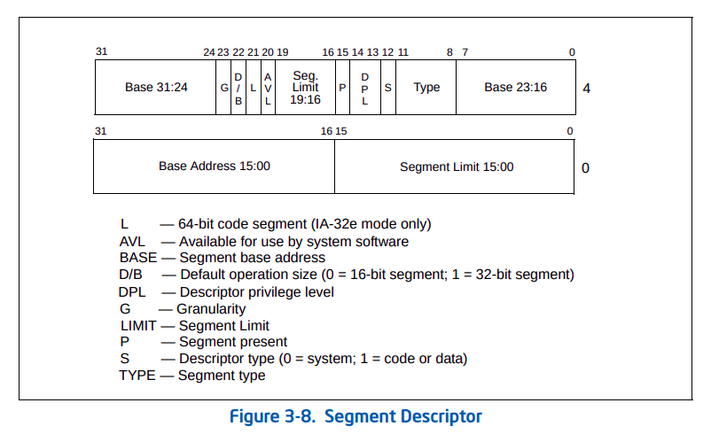

# [GDT](https://github.com/codenet/vmm-reference/blob/main/src/vm-vcpu-ref/src/x86_64/gdt.rs)

This is breif description of file [gdt.rs](https://github.com/codenet/vmm-reference/blob/main/src/vm-vcpu-ref/src/x86_64/gdt.rs)

This module is used for building Global Descriptors Table (GDT) and writing it to Guest Memory.

The module uses following crates-
- [`kvm-bindings`](https://github.com/rust-vmm/kvm-bindings): To use `kvm_segment` struct which is the datatype of all sregs registers (cs, ds, es, fs etc.) in `KvmVcpu` (see [file](https://github.com/codenet/vmm-reference/blob/main/src/vm-vcpu/src/vcpu/mod.rs))
- [`vm-memory`](https://github.com/rust-vmm/vm-memory): used when writing GDT to Guest Memory

<br/><br/>
Let's now start understanding the different parts of the file-
## `SegmentDescriptor`
```rs
pub struct SegmentDescriptor(pub u64);
```
SegmentDescriptor is the class to create GDT entries and export them as `kvm_segment`. 

The segment descriptor has following structure (from Section "3.4.5 Segment Descriptors" of the [Intel Manual](https://www.intel.com/content/dam/www/public/us/en/documents/manuals/64-ia-32-architectures-software-developer-vol-3a-part-1-manual.pdf))

<br/><br/>

Now let's look at the methods of the class-
### `from`
```rs
pub fn from(flags: u16, base: u32, limit: u32) -> Self
```
This method creates segment descriptor from the arguments `base`, `limit` and  `flags`. The descriptions of these and strcutrure of the 64 bits are the same as given in the above figure.
<br/><br/>

### Segment Descriptor Fields Extraction Methods
```rs
fn base(&self) -> u64
fn limit(&self) -> u32
fn g(&self) -> u8
fn db(&self) -> u8
fn l(&self) -> u8
fn avl(&self) -> u8
fn p(&self) -> u8
fn dpl(&self) -> u8
fn s(&self) -> u8
fn segment_type(&self) -> u8 
```
All the fields are explianed in the figure above. These methods extract the values of these fields from the 64 bits stored in the class.
<br/><br/>

### `create_kvm_segment`
```rs
fn create_kvm_segment(&self, table_index: usize) -> kvm_segment {
    kvm_segment {
        base: self.base(),
        limit: self.limit(),
        // The multiplication is safe because the table_index can be maximum
        // `MAX_GDT_SIZE`. The conversion is safe because the result fits in u16.
        selector: (table_index * 8) as u16,
        type_: self.segment_type(),
        present: self.p(),
        dpl: self.dpl(),
        db: self.db(),
        s: self.s(),
        l: self.l(),
        g: self.g(),
        avl: self.avl(),
        padding: 0,
        unusable: match self.p() {
            0 => 1,
            _ => 0,
        },
    }
}
```
This method creates a `kvm_segment` from `SegmentDescriptor` object. 

All the fields are the same as the segment descriptor except for `selector` and `unusable`.

- `selector` stores the 16 bit segment selector value. First 13 bits are index of the entry in GDT table and last 3 bits are flags (TI and RPL) which are set to 0 here.
  - TI specifies which descriptor table to use. It's set if LDT (Local Descriptor Table) is used.
  - RPL is requested Privilege Level of the selector.
- If the entry is not present then it is `unusable`.
<br/><br/>

## `Gdt`
```rs
pub struct Gdt(Vec<SegmentDescriptor>);
```
`Gdt` is a wrapper for creating and managing operations on the Global Descriptor Table (GDT).

This class has methods `new`, `try_push`, `create_kvm_segment_for` and `write_to_mem`.
<br/><br/> 

### `new`
```rs
pub fn new() -> Gdt
```
This just creates empty GDT.
<br/><br/>

### `try_push`
```rs
pub fn try_push(&mut self, entry: SegmentDescriptor) -> Result<()> {
    if self.0.len() >= MAX_GDT_SIZE {
        return Err(Error::TooManyEntries);
    }
    self.0.push(entry);
    Ok(())
}
```
This method tries to push an entry (`SegmentDescriptor` object) to the GDT and is successful if the size of GDT is less than `MAX_GDT_SIZE` (set to 2<sup>13</sup>).
<br/><br/>

### `create_kvm_segment_for`
```rs
pub fn create_kvm_segment_for(&self, index: usize) -> Option<kvm_segment> 
```
This method creates and returns `kvm_segmet` for the GDT entry at given index. 
<br/><br/>

### `write_to_mem`
```rs
pub fn write_to_mem<Memory: GuestMemory>(&self, mem: &Memory) -> Result<()> {
    let boot_gdt_addr = GuestAddress(BOOT_GDT_OFFSET);
    for (index, entry) in self.0.iter().enumerate() {
        // The multiplication below cannot fail because we can have maximum 8192 entries in
        // the gdt table, and 8192 * 4 (size_of::<u64>) fits in usize
        let addr = mem
            .checked_offset(boot_gdt_addr, index * mem::size_of::<SegmentDescriptor>())
            .ok_or(GuestMemoryError::InvalidGuestAddress(boot_gdt_addr))?;
        mem.write_obj(*entry, addr)?;
    }
    Ok(())
}
```
This method writes the GDT into the Guest Memory with GDT base at address `BOOT_GDT_OFFSET` (equals `0x500`).
<br/><br/>

### Default GDT
```rs
fn default() -> Self {
    Gdt(vec![
        SegmentDescriptor::from(0, 0, 0),            // NULL
        SegmentDescriptor::from(0xa09b, 0, 0xfffff), // CODE
        SegmentDescriptor::from(0xc093, 0, 0xfffff), // DATA
        SegmentDescriptor::from(0x808b, 0, 0xfffff), // TSS
    ])
}
```
- `Gdt` provides a default implementation ("Flat Memory Model") that can be used for setting up a vCPU for booting.
- The default implementation contains all 4 segment descriptors corresponding to null, code, data, and TSS. 
- The default can beextended by using `try_push`.
<br/><br/>

## IDT
This file also provides a method `write_idt_value` to write val in the IDT Offset (equals `0x520`).
<br/><br/>

<br/><br/>

### Uses in the codebase
This file has been used in [this file](https://github.com/codenet/vmm-reference/blob/main/src/vm-vcpu/src/vcpu/mod.rs) in `configure_sregs` method of class `KvmCpu`. The modules are used for the following (in the specified order).
```rs
let gdt_table = Gdt::default();
```
- Create Default GDT 
```rs
let code_seg = gdt_table.create_kvm_segment_for(1).unwrap();
let data_seg = gdt_table.create_kvm_segment_for(2).unwrap();
let tss_seg = gdt_table.create_kvm_segment_for(3).unwrap();
```
- Convert default segment descriptors for code, data and tss to `kvm_segment` (to be stored in `sregs`) 
```rs
gdt_table.write_to_mem(guest_memory).map_err(Error::Gdt)?;
```
- Write GDT Table into Guest Memory
```rs
write_idt_value(0, guest_memory).map_err(Error::Gdt)?;
```
- Write IDT Offset value (default 0)
  

